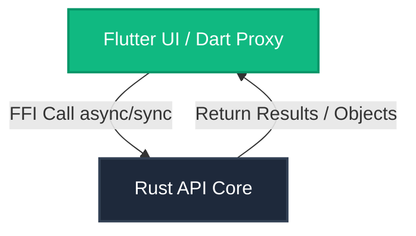

# Void — Architecture & Developer Guidelines

**IMPORTANT INSTRUCTION FOR ALL DEVELOPERS AND AI AGENTS: READ THIS DOCUMENT BEFORE UNDERTAKING ANY DEVELOPMENT TASK OR MODIFYING THE CODEBASE.**

Void is a premium, high-fidelity hybrid music player and downloader built using **Flutter/Dart** for the frontend and **Rust** for core business logic, filesystem operations, and high-performance audio processing. The communication between Flutter and Rust is powered by `flutter_rust_bridge` (v2).

---

## 🏗️ Core Architectural Rules

To maintain a clean separation of concerns and ensure high performance, Void enforces a strict boundary between the user interface and business logic.



### 1. UI is Handled by Flutter (Dart)
* **Visual Components**: All screens, layouts, sliders, dialogs, widgets, theme configurations, route navigation, and animation controllers must be written in Dart.
* **No Local Logic**: Dart must contain **no core business logic**. It captures user events, passes parameters/arguments to Rust FFI endpoints, receives the computed outputs, and renders the corresponding UI states.

### 2. Logic, Algorithms, & Heavy Computations are Handled by Rust
* **Heavy Tasks**: All algorithms, sorting, case-insensitive searches, file operations, native filesystem scanning, binary parsing, and metadata extraction must live in Rust.
* **Storage Location**: Rust modules must be placed under the `rust/src/api/` directory.

### 3. FFI Boundaries & Calling Conventions
* **CodeGen Generation**: Whenever you modify any Rust code in the `rust/src/api/` directory, you must run the following command in the project root directory to regenerate the bridge bindings:
  ```bash
  flutter_rust_bridge_codegen generate
  ```
* **Synchronous Calls (`#[flutter_rust_bridge::frb(sync)]`)**:
  * Lightweight calculations, serialization/deserialization helpers, string sanitizers, and formatters must be annotated with `#[flutter_rust_bridge::frb(sync)]` in Rust. This enables Dart to call them instantly and synchronously without dealing with `Future` queues.
* **Asynchronous Calls**:
  * File I/O operations (deletions, copies, renames) and recursive scans of the filesystem must run asynchronously (without the `sync` flag) to avoid blocking the main UI thread.

### 4. Platform API Layer (Dart Proxy)
* Actions requiring direct integration with the native mobile OS must be handled in Dart using platform plugins:
  * **Audio Playback**: Powered by `just_audio` and `audio_service` for system notifications and lockscreen media keys.
  * **Bluetooth Monitoring**: Powered by `flutter_blue_plus` to monitor connection state changes.
  * **Notifications**: Powered by `flutter_local_notifications`.
  * **Local Configuration Storage**: Persisted via `shared_preferences`.
* **State Syncing**: The Dart wrapper must immediately sync any background OS events (such as media track shifts, Bluetooth disconnects) with Rust-backed state variables (e.g. syncing `currentlyPlaying` by listening to `mediaItem` stream updates).

---

## 🛠️ Rust API Modules (`rust/src/api/`)

The core engine of Void is divided into dedicated domain modules in Rust:

### 1. [models.rs](file:///home/zer/Documents/musicApp/rust/src/api/models.rs) — Data Structures
Defines FFI-compatible structs shared between Dart and Rust:
* `SongMetadata`: Holds file details including `title`, `artist`, `album`, `duration_seconds`, `path`, `modified_date`, and `cover_path` (extracted image).
* `Playlist`: Maps playlist details (`name`, `songs` list of file paths, and `is_system` indicator).
* `PlayCountEntry` & `LyricsEntry`: Store play count stats and custom user lyrics.
* `RenameResult` & `DeleteResult`: Status flags and error descriptions for file actions.
* `NextSongResult`: Computed index and success flag for music queue progression.

### 2. [scanner.rs](file:///home/zer/Documents/musicApp/rust/src/api/scanner.rs) — Filesystem Scan & Media Parser
* **Path Resolver**: Combines system base paths (such as `/storage/emulated/0`) and standard music subdirectories (`Music`, `Download`, `DCIM`, etc.) into a deduplicated list.
* **File Walk**: Recursively traverses the directories using the `walkdir` crate, filtering files matching supported audio extensions (`mp3`, `m4a`, `wav`, `flac`, `ogg`, `aac`).
* **Lofty Metadata Engine**: Extracts audio properties and metadata tags using the `lofty` crate.
* **Cover Art Caching**: Extracts embedded picture metadata from audio files, hashes the file path to generate a unique filename, saves it to the temporary cache directory as a JPEG, and returns the cached path back to Dart.

### 3. [playlist.rs](file:///home/zer/Documents/musicApp/rust/src/api/playlist.rs) — JSON Serialization & Favorites Computation
* **Serialization/Deserialization**: Exposes quick synchronous helpers to serialize and deserialize playlists, play counts, and lyrics map database models into JSON strings, which are then saved in Dart's `SharedPreferences` storage.
* **Favorites Calculator**: Analyzes a list of play count statistics and computes the top N most-played audio files, sorted by count descending.
* **Playlist Mutators**: Provides safe functions to add or remove tracks inside a playlist.

### 4. [playback.rs](file:///home/zer/Documents/musicApp/rust/src/api/playback.rs) — Queue Navigation
* **Next Index Calculation**: Computes the index of the next song based on shuffle toggle, loop mode (`off`, `all`, `one`), and a timestamp seed.
  * *Pseudo-Random Generator*: Shuffle uses a custom LCG formula: `seed.wrapping_mul(6364136223846793005).wrapping_add(1442695040888963407)` to ensure clean transitions and prevent repeating the current song immediately.
* **Previous Index Calculation**: Computes the previous song index.
  * *Smart Logic*: Replays the current track from the beginning if it has already played for more than 3 seconds, rather than skipping back to the previous song.

### 5. [file_ops.rs](file:///home/zer/Documents/musicApp/rust/src/api/file_ops.rs) — Safe Filesystem Manager
* **Safe Rename Paths**: Sanitizes user inputs, removing invalid characters and keeping only alphanumeric characters, spaces, hyphens, and underscores.
* **Atomic Renaming**: Renames the physical audio file on the device by performing a copy followed by deleting the source.
* **File Deletion**: Physically deletes files from storage.
* **Playlist Path Update**: Walks through cached playlists and updates the file path of renamed songs to keep database consistency.

### 6. [format.rs](file:///home/zer/Documents/musicApp/rust/src/api/format.rs) — Utility Formatters
* **Duration Formatter**: Formats seconds into `M:SS` or `H:MM:SS` strings.
* **File Size Formatter**: Formats bytes into human-readable strings (e.g. `KB`, `MB`, `GB`).
* **YouTube Check**: Checks if the URL is a valid YouTube address.
* **Sanitization**: Utility function to strip illegal characters from file names.

### 7. [trimmer.rs](file:///home/zer/Documents/musicApp/rust/src/api/trimmer.rs) — Native Audio Slicer
Exposes premium native lossless audio trimming for audio editing:
* `trim_mp3`: Parses raw MP3 streams frame-by-frame:
  1. Skips ID3v2 metadata header if present to avoid breaking structural calculations.
  2. Scans audio frames by matching syncwords (`0xFF` and `0xF0` mask).
  3. Decodes sample rates, Layer III coefficients, and frame sizes.
  4. Slices the audio byte stream at start/end second limits.
  5. Appends the original ID3 tags back into the sliced file to preserve album art and track metadata.
* `trim_wav`: Slices WAV (PCM) files:
  1. Parses the header `fmt ` chunk to extract channel count, sample rate, and byte alignment.
  2. Locates the `data` chunk and maps raw PCM data.
  3. Computes block-aligned start and end byte offsets.
  4. Updates the file headers (recalculating RIFF size at byte offset 4 and `data` chunk size at offset 44).
  5. Writes the new WAV header alongside the sliced PCM data to disk.

---

## 📱 Dart Features & UI Structure (`lib/`)

The Flutter application architecture divides the features logically inside the `lib/` directory:

```
lib/
├── app.dart                               # Root App setup, navigation & theme bindings
├── main.dart                              # Initializes RustLib, Audio services & launches app
├── core/
│   ├── audio_handler.dart                 # Custom media controls bridge using just_audio
│   ├── theme/
│   │   └── app_colors.dart                # Theme colors and gradient definitions
│   └── services/
│       ├── audio_service.dart             # Global audio player wrapper (Bluetooth, Timer)
│       ├── notification_service.dart      # Local download progress indicators
│       └── theme_service.dart             # Dark/Light theme persist manager
└── features/
    ├── loading/                           # Turntable spinner & initial system checking
    ├── home/                              # Bottom bar route router
    ├── all_songs/                         # Scanned library list & contextual edit tools
    ├── playlists/                         # Favorites and customized folders
    ├── browse/                            # Search and YouTube file streaming
    ├── converter/                         # Local voice recorder & file transcode posting
    └── tutorial/                          # Multi-page interactive user guide
```

### 1. Core Services & Media Bridge
* **Audio Handler**: [MyAudioHandler](file:///home/zer/Documents/musicApp/lib/core/audio_handler.dart) coordinates with `audio_service` to receive media control triggers (Play, Pause, Skip, Seek, Stop) from notification trays, Bluetooth devices, and Android Wear.
* **Global Audio Service**: [GlobalAudioService](file:///home/zer/Documents/musicApp/lib/core/services/audio_service.dart) is a singleton orchestrator. It manages:
  * Shuffle and repeat states.
  * Active playlist queues.
  * **Smart Bluetooth Integration**: Monitors Bluetooth state changes. Automatically pauses playback upon headset disconnection, records playback location, and auto-resumes once reconnected.
  * **Sleep Timer**: Triggers fade-outs and pauses playback when the scheduled duration completes.
* **Theme Service**: Exposes dark, light, and system auto-adjust theme updates, saving choice preferences locally.

### 2. Feature Screens
* **Loading Screen**: [LoadingScreen](file:///home/zer/Documents/musicApp/lib/features/loading/loading_screen.dart) renders a custom-painted spinning vinyl disc, a pulsing glow animation, and a synchronized music equalizer visualization. It holds navigation until FFI bindings and background audio servers are loaded.
* **All Songs Screen**: [AllSongsScreen](file:///home/zer/Documents/musicApp/lib/features/all_songs/all_songs_screen.dart) provides search functionality (backed by Rust string matching), scanning trigger buttons, and a metadata editing context menu:
  * *Edit Dialogs*: Rename, Delete, Trim Audio (via [TrimAudioDialog](file:///home/zer/Documents/musicApp/lib/features/all_songs/dialogs/trim_dialog.dart)), and Lyrics Editor (which saves synced lyrics per song).
* **Playlists Screen**: [PlaylistScreen](file:///home/zer/Documents/musicApp/lib/features/playlists/playlist_screen.dart) coordinates custom playlists. Favorites lists are compiled dynamically by monitoring play counts, taking the top 10 most played tracks automatically.
* **Browse Screen**: [BrowseSongsScreen](file:///home/zer/Documents/musicApp/lib/features/browse/browse_songs_screen.dart) searches videos on YouTube using `youtube_explode_dart`. It sends download requests to the external converter API (`https://youtube-mp3-api-fgve.onrender.com/api/download`), which transcodes and streams back an audio file (saved as `.m4a` or `.mp3` directly inside the device's default `Music` folder). Shows persistent progress indicators via [DownloadNotificationService](file:///home/zer/Documents/musicApp/lib/core/services/notification_service.dart).
* **Converter Screen**: [ConverterScreen](file:///home/zer/Documents/musicApp/lib/features/converter/converter_screen.dart) enables users to transcode video/audio files or record voice notes (via `record` library). It uploads files via multi-part requests to the server's `/api/convert` endpoint and downloads the resulting file in the chosen format (`mp3` or `m4a`).

---

## 🎨 Theme & Visual Styling

Void adopts a premium, high-contrast dark theme by default:
* **Deep Obsidian**: Card and backgrounds use slate-obsidian colors (`0xFF0B0F19` / `0xFF1E293B`) to highlight media cover arts.
* **Mint/Emerald Green**: The accent/primary shade is styled with Vibrant Emerald Green (`0xFF10B981`, mapped internally to `AppColors.purple`).
* **Royal Blue**: Used as secondary accents (`0xFF3B82F6`) for sliders, buttons, and progress indicators.
* **Overlay Transition**: Switching between Dark and Light mode initiates a custom fade transition using a full-screen backdrop painter.

---

## 🚀 Setting Up & Building the Project

### Prerequisites
1. **Flutter SDK**: Ensure you have Flutter SDK installed (SDK `>=3.4.0 <4.0.0`).
2. **Rust Toolchain**: Install Rust compiler (`rustc` and `cargo`).
3. **Android NDK**: Required to compile Rust libraries for Android targets.
4. **flutter_rust_bridge_codegen**: Install the codegen CLI:
   ```bash
   cargo install flutter_rust_bridge_codegen --version 2.12.0
   ```

### Quick Build & Run Steps

1. **Clone and Navigate**:
   ```bash
   cd /home/zer/Documents/musicApp
   ```
2. **Install Flutter Dependencies**:
   ```bash
   flutter pub get
   ```
3. **Generate FFI Bindings**:
   Whenever Rust files are modified under `rust/src/api/`, generate the FFI bindings using:
   ```bash
   flutter_rust_bridge_codegen generate
   ```
4. **Compile and Run**:
   * Run the developer build:
     ```bash
     flutter run
     ```
   * Build Android APK (Release mode compiles Rust binaries to native libraries inside the APK package):
     ```bash
     flutter build apk --release
     ```

---

## ⚠️ Common Developer Pitfalls

* **Android Crash on Audio Initialisation**:
  * *Behavior*: App immediately stops with `void_app has stopped` in release mode.
  * *Cause*: Initializing `AudioService` (which binds Android's `MediaBrowserServiceCompat`) before Flutter's native activity is fully attached and in the `Started` state.
  * *Fix*: `runApp()` MUST be called before triggering `AudioService.init()`. Ensure `_initializeAudioServices()` runs in a fire-and-forget delayed stream as configured in `main.dart`.
* **Rust Mod Files Configuration**:
  * Adding a new `.rs` code file under `rust/src/api/` requires declaring the module inside `rust/src/api/mod.rs` to expose it to the `flutter_rust_bridge` generator.
